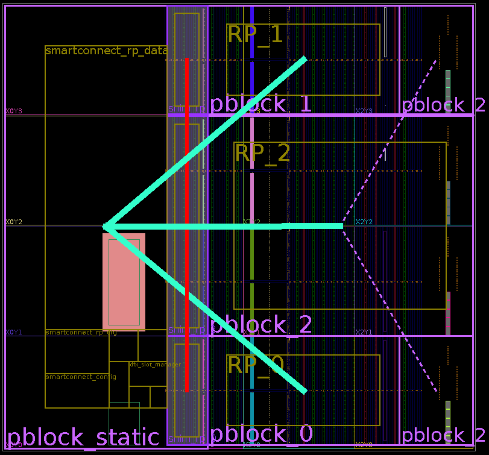
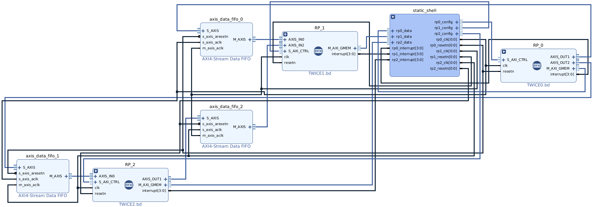
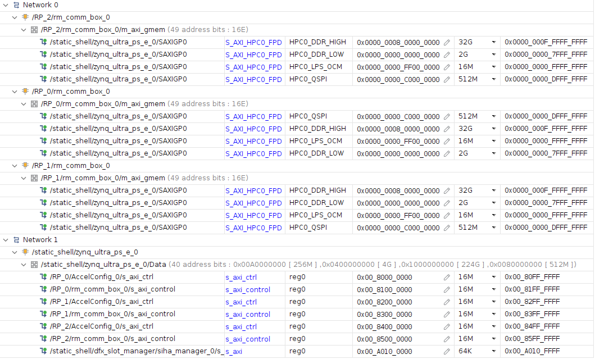
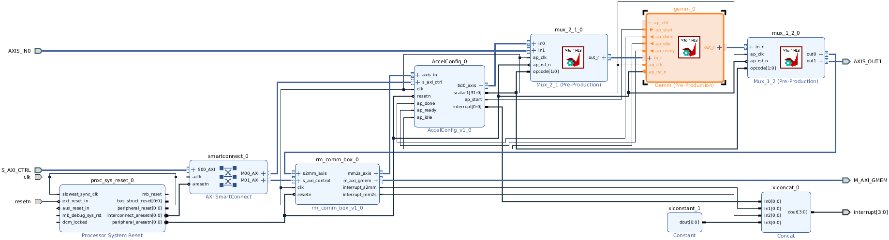

# dfx-3rp

This work successfully implements a layout of three reconfigurable partitions on the FPGA of a Xilinx KV260 multi-processor system-on-chip (MPSoC).
Reconfigurable modules for sparse matrix decompression, dense matrix multiplication, and sparse matrix compression are deployed on these partitions respectively.
The reconfigurable partitions directly access the KV260's memory via the AXI Memory Mapped protocol and are interconnected using the AXI Stream protocol.
The reconfigurable modules are written in the high-level synthesis language,
enabling full utilization of FPGA hardware resources for parallel and pipelined processing.
The dense matrix multiplication is optimized using tiling and a systolic array, with each block sized at 12×12.
For a 128×128 matrix multiplication, this achieves a 25× speedup compared to a naive CPU algorithm.

Applications have been developed to invoke the computational modules on the FPGA,
realizing heterogeneous accelerated computing. The system supports sparse matrix decompression,
compression, and multiplication operations for COO, CSR, and CSC sparse formats.

## Reproduction Steps

Note: We also provide ready-to-use binaries in [this repo](https://github.com/fjtcin/dfx-3rp-bin).

### High-Level Synthesis (HLS)

The [hls](hls/) directory constains IP source code for Sparse Matrix-Matrix Multiplication (SPMM). Create a Vitis HLS project for each IP, compile the code and export the IP using the IDE. We also provide the IPs [here](https://github.com/fjtcin/dfx-3rp-bin/tree/main/ip_repo).

### Generate Configuration Files

0. clone this repo to a local directory, alongside the `ip_repo` created from the previous step. We should also merge [IPs provided by Xilinx](https://github.com/Xilinx/kria-dfx-hw/tree/xlnx_rel_v2022.1/k26/ip_repo) into our SPMM `ip_repo`.

1. (optional) clean the local clone

```bash
git clean -dfX
```

2. Generate Reconfigurable Partitions (RPs): This step takes half an hour and consumes 55 GiB of memory. Adjust the `jobs` number in [opendfx_shell.tcl](opendfx_shell.tcl) if you run into out-of-memory issues.

```bash
vivado -mode batch -notrace -source ./opendfx_shell.tcl
```

3. Copy Reconfigurable Modules (RMs): This script copies the generated configuration files from the Vivado project to the [configs](configs/) directory. The configs directory can then be copied to KV260. We also provide the binaries [here](https://github.com/fjtcin/dfx-3rp-bin/tree/main/dfx-3rp/configs).

```bash
python finalize.py
```

## Features

* On the Xilinx KV260 platform's FPGA, a hardware architecture featuring three independent RPs was designed and implemented. This multi-RP architecture allows for the coexistence or rapid replacement of various matrix operation modules (RMs), providing the hardware foundation for implementing complex computational pipelines or processing different tasks in parallel.

* Using the Vitis HLS tool, a series of RMs were developed in C/C++ for different matrix operation tasks, including:
    * Sparse matrix decompression (converting a specific sparse format to a dense format)
    * Dense matrix multiplication
    * Sparse matrix compression (converting a dense format to a specific sparse format)
    * Sparse matrix format conversion (achievable through a combination of decompression and compression RMs)
    * Sparse matrix multiplication (achievable through combinations/sequences of RMs, such as decompression + dense multiplication, or decompression + dense multiplication + compression)

    These modules are designed to be dynamically loaded into the RPs, enabling the system to configure the appropriate hardware acceleration logic and switch its handling of different sparse matrix formats based on specific task requirements.

* The designed RMs all adopt standard AXI interface protocols. The AXIMM interface is used for efficient access to the KV260's shared DDR memory, enabling high-throughput for large-scale data. The AXIS interface is used to connect different RMs, supporting the construction of dataflow-driven computational pipelines within the FPGA. The system runs on an Ubuntu Linux operating system on the KV260's ARM processor. Through the Xilinx Runtime (XRT) library, application software can manage and invoke FPGA hardware resources (including DFX operations and RM task execution).

## Experiement Results

Dense matrix multiplication (GEMM):

| Matrix Size | CPU Time (ms) | FPGA time (ms) | Speedup |
| :---: | :---: | :---: | :---: |
| 12×12 | 0.015 | 0.012 | 1.3× |
| 16×16 | 0.034 | 0.019 | 1.8× |
| 32×32 | 0.26 | 0.047 | 5.5× |
| 36×36 | 0.37 | 0.052 | 7.1× |
| 60×60 | 1.7 | 0.17 | 10× |
| 64×64 | 2.0 | 0.24 | 8.3× |
| 96×96 | 7.3 | 0.56 | 13× |
| 120×120 | 15 | 1.0 | 15× |
| 127×127 | 17 | 1.3 | 13× |
| 128×128 | 32 | 1.3 | 25× |

## Hardware Design Details

This project is based on [Xilinx's DFX Example](https://xilinx.github.io/kria-apps-docs/dfx/build/html/docs/DFX_Landing_Page.html). Check out [this slide]() for some gory details of implementation.

### Overview



As shown in the figure, we have divided the FPGA into a *static region* on the left and a *dynamic region* on the right.

The static region contains the fundamental logic necessary for system operation, such as the interface controller for the PS (Processing System), clock management, interrupt management, and the FIFO buffers that connect to the RPs. This design successfully implements three independent RPs, which provide the physical foundation for dynamically loading different computational modules. Each RP is designed to accommodate one RM.

The specific RMs deployed include a sparse matrix decompression module, a dense matrix multiplication module that uses a systolic array combined with a tiling strategy (more info [here](hls/systolic/)), and a sparse matrix compression module. These modules are all written in Vitis HLS and, through carefully designed `pragma` directives, achieve a high degree of parallel computation and pipelined operations. This maximizes the utilization of the FPGA's hardware resources and enhances computational efficiency.

### Interconnection





Interface design is crucial for ensuring efficient data flow and the collaborative operation of modules. As shown in the first figure, the AXI4 Memory Mapped (AXIMM) protocol is adopted for the interaction between the RPs and the KV260's on-chip memory. This allows each dynamically loaded RM to directly and efficiently perform read and write operations on the main system memory, providing a high-bandwidth channel for the transmission of large-scale matrix data. The exchange of control and status signals (CONFIG) between the static and dynamic regions is implemented through the AXI4 Lite interface. The second figure illustrates the address space allocated for the AXIMM and AXI4 Lite interfaces.

To enable data stream transfer and cooperative processing between RMs (for instance, to send decompressed data directly to the multiplication module), we have designed an interconnection interface based on the AXI4 Stream (AXIS) protocol. This streaming interface is highly suitable for pipelined processing flows and can effectively reduce the latency of data transfer between modules. We have added FIFO buffers between the RPs to achieve better pipelining.

### Reconfigurable Modules



Using the dense matrix multiplication RP as an example, the figure illustrates the internal structure of an RP. Besides the HLS accelerator kernel, the most crucial component is the `rm_comm_box` data mover IP core. It is equipped with an AXIMM interface (DMA) for reading from and writing to memory such as DDR/BRAM, an AXIS output port for providing input to the accelerator, and an AXIS input port for reading data from the accelerator. This IP core contains two engines: the mm2s engine reads data from a memory address via AXIMM and provides it through the AXIS stream output port; the s2mm engine performs the reverse process.

Since the input/output source of an RP is not fixed (it could be the DDR AXIMM or an AXIS port from another RP), we have implemented two multiplexers. The control signals for these multiplexers are transmitted through a virtual AXIS channel provided by the `rm_comm_box` (managed by the host application), which is distinct from other control signals transmitted via AXI Lite.
